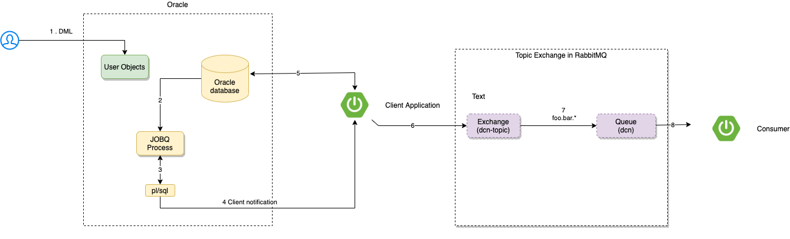

# Ejemplo aplicación con listener Oracle CDN

El objetivo de esta PoC es crear una aplicación que sea capaz de obtener notificaciones de cambios en una tabla de `Oracle`. Para ello se hace uso de 'Oracle Database Change Notificacion' (CDN).

`Database Change Notifications` es una función que permite a las aplicaciones cliente registrar consultas con la base de datos y recibir notificaciones en respuesta a cambios `DML` o `DDL` en los objetos asociados a las consultas. Las notificaciones son publicadas por la base de datos cuando la transacción DML o DDL se confirma.

Durante el registro, la aplicación especifica un gestor de notificaciones y asocia un conjunto de consultas asociadas con el gestor de notificaciones. Un manejador de notificaciones puede ser un procedimiento PL/SQL del lado del servidor o un `callback` del lado del cliente. Se crean registros en todos los objetos referenciados durante la ejecución de las consultas. El gestor de notificaciones se invoca cuando una transacción cambia posteriormente cualquiera de los objetos registrados y se compromete. Para el caso de esta `PoC` el manejador de notificaciones es una aplicación Java, la cual recibe notificaciones a través de `callback`.

Más información sobre `CDN` se puede consultar aquí:

https://docs.oracle.com/cd/E11882_01/java.112/e16548/dbchgnf.htm#JJDBC28815

## Stack tecnológico 

- Java 8+
- Spring Boot 2.4+
- Oracle 18.4.0 XE
- Rabbit MQ como broker de mensajería

## Requisitos para poder ejecutar el ejemplo

- Git
- [Virtualbox](https://www.virtualbox.org/)
- [vagrant](https://www.vagrantup.com/)
- [Docker](https://www.docker.com/)
- JDK 

## Introducción

La `PoC` consiste en una aplicación `Spring Boot` que solicita la notificación de cambios en una tabla que reside en base de datos

La tabla sobre la que solicita la notificación de cambios es la siguiente:

```
CREATE TABLE notifications (
id                 NUMBER,
message            VARCHAR2(4000),
notification_date  DATE
);
```



Una vez recibe el evento, la aplicación envía un mensaje al broker de mensajería para que el consumidor lo reciba y pueda tratarlo.

## Pasos a ejecutar la aplicación

### Arrancar instancia Oracle

Lo primero es arrancar la base de datos Oracle. Para esta PoC se ha utlizado la versión `18.4.0 XE` de Oracle.

Para arrancalar se puede realizar mediante el comando siguiente sobre la ruta `oracle`

```
vagrant up
```

1. La primera vez que ejecute esto, se aprovisionará todo y puede tardar un poco. Asegúrate de tener una buena conexión a Internet, ya que los scripts actualizarán la VM a la última versión a través de `yum`.
2. Conéctese a la base de datos

Los parámetros de configuración por defecto para conectar a la base de datos es la siguiente:

* Hostname: `localhost`
* Port: `1521`
* SID: `XE`
* PDB: `XEPDB1`
* EM Express port: `5500`
* Database passwords : `oracle`

3. Se puede apagar la VM mediante el habitual `vagrant halt` y volver a arrancarla mediante `vagrant up`.

Una vez arrancada la instancia, se habrán ejecutado los scripts siguientes que se encuentran en la ruta `oracle/userscripts`:

- `grant_notifications.sql`. Este script se encarga de dar permisos de notificaciones al usuario `SYSTEM`

```  
grant change notification to system;
```

- `notifications.sql`: Script que se encarga de crear la tabla `notifications` necesaria para el ejemplo:

```
CREATE TABLE SYSTEM.NOTIFICATIONS (
                               id                 NUMBER,
                               message            VARCHAR2(4000),
                               notification_date  DATE
);
```

Si cuando arranque la instancia, no se encuentra la tabla en el esquema SYSTEM, se puede ejecutar directamente el script de creación de la tabla.

Para conectar a la base de datos se puede realizar desde cualquier cliente Oracle. Si lo desea puede acceder desde `sqlplus`. 
Para ello puedes hacerlo mediante el comando `vagrant ssh`:

```
vagrant ssh

Welcome to Oracle Linux Server release 7.9 (GNU/Linux 5.4.17-2036.100.6.1.el7uek.x86_64)

The Oracle Linux End-User License Agreement can be viewed here:

  * /usr/share/eula/eula.en_US

For additional packages, updates, documentation and community help, see:

  * https://yum.oracle.com/

[vagrant@localhost ~]$ sudo su - oracle
Last login: Tue Feb  9 17:12:53 +01 2021
[oracle@localhost ~]$ sqlplus

SQL*Plus: Release 18.0.0.0.0 - Production on Tue Feb 9 17:13:34 2021
Version 18.4.0.0.0

Copyright (c) 1982, 2018, Oracle.  All rights reserved.

Enter user-name: system
Enter password:
Last Successful login time: Mon Feb 08 2021 17:10:24 +01:00

Connected to:
Oracle Database 18c Express Edition Release 18.0.0.0.0 - Production
Version 18.4.0.0.0

SQL>
```

Más información sobre el despliegue de Oracle XE con vagrant se puede consultar en el `README.md` que se encuentra en la carpeta `oracle` del proyecto.


### Desplegar borker RabbitMQ

Lo siguiente que es necesario desplegar es el borker AMQP RabbitMQ, para ello simplemente se puede ejecutar el siguiente comando sobre la ruta del proyecto

```
docker-compose up -d
```

Se ejecutará el siguiente `docker-compose`

```
version: "3.5"
services:

  rabbitmq:
    image: rabbitmq:management
    ports:
      - "5672:5672"
      - "15672:15672"
```

### Desplegar la aplicación

Una vez desplegada la infraestructura necesaria, ya se puede arrancar la aplicación `Spring Boot`. Para ello se puede ejecutar, por ejemplo con el comando `maven`

```
mvn spring-boot:run -q
```

```
  .   ____          _            __ _ _
 /\\ / ___'_ __ _ _(_)_ __  __ _ \ \ \ \
( ( )\___ | '_ | '_| | '_ \/ _` | \ \ \ \
 \\/  ___)| |_)| | | | | || (_| |  ) ) ) )
  '  |____| .__|_| |_|_| |_\__, | / / / /
 =========|_|==============|___/=/_/_/_/
 :: Spring Boot ::                (v2.4.2)

2021-02-08 16:37:13.099  INFO 15697 --- [           main] c.m.examples.demodcn.DemoDcnApplication  : Starting DemoDcnApplication using Java 1.8.0_162 on MacBook-Pro-2.local with PID 15697 (/Users/jose/desarrollo/mapfre/repo/demo-dcn/target/classes started by jose in /Users/jose/desarrollo/mapfre/repo/demo-dcn)
2021-02-08 16:37:13.103  INFO 15697 --- [           main] c.m.examples.demodcn.DemoDcnApplication  : No active profile set, falling back to default profiles: default
2021-02-08 16:37:16.169  INFO 15697 --- [           main] c.m.e.demodcn.dcn.config.DcnRegister     : Table SYSTEM.NOTIFICATIONS registered.
2021-02-08 16:37:16.315  INFO 15697 --- [           main] o.s.a.r.c.CachingConnectionFactory       : Attempting to connect to: [localhost:5672]
2021-02-08 16:37:16.412  INFO 15697 --- [           main] o.s.a.r.c.CachingConnectionFactory       : Created new connection: rabbitConnectionFactory#192d74fb:0/SimpleConnection@1eea9d2d [delegate=amqp://guest@127.0.0.1:5672/, localPort= 54529]
2021-02-08 16:37:16.416  INFO 15697 --- [           main] o.s.amqp.rabbit.core.RabbitAdmin         : Auto-declaring a non-durable, auto-delete, or exclusive Queue (dcn) durable:false, auto-delete:false, exclusive:false. It will be redeclared if the broker stops and is restarted while the connection factory is alive, but all messages will be lost.
2021-02-08 16:37:16.489  INFO 15697 --- [           main] c.m.examples.demodcn.DemoDcnApplication  : Started DemoDcnApplication in 4.018 seconds (JVM running for 4.773)
2021-02-08 16:37:16.490  INFO 15697 --- [           main] c.m.examples.demodcn.DemoDcnApplication  : Executing app with listener to Oracle databse ...

```

#### Detalles implementación

La configuración donde se indica a la aplicación que quiere escuchar eventos de cambios para la tabla de `notfications` se indica en esta clase:

```
@Slf4j
public class DcnRegister {

    public static final String SELECT_FROM_NOTIFICATIONS = "select * from notifications";
    private DataSource dataSource;

    private DCNListener listener;

    private OracleConnection oracleConnection = null;
    @Getter
    private DatabaseChangeRegistration dcr = null;
    private Statement statement = null;


    @Autowired
    public DcnRegister(DataSource dataSource, DCNListener listener) {
        this.dataSource = dataSource;
        this.listener = listener;
    }


    @PostConstruct
    public void init() {
        this.register();
    }


    private void register() {

        Properties props = new Properties();
        props.put(OracleConnection.DCN_NOTIFY_ROWIDS, "true");
        props.setProperty(OracleConnection.DCN_QUERY_CHANGE_NOTIFICATION, "true");
        props.setProperty(OracleConnection.DCN_BEST_EFFORT,"true");
        try {

            oracleConnection = (OracleConnection) dataSource.getConnection();

            dcr = oracleConnection.registerDatabaseChangeNotification(props);
            statement = oracleConnection.createStatement();
            ((OracleStatement) statement).setDatabaseChangeRegistration(dcr);

            statement.executeQuery(SELECT_FROM_NOTIFICATIONS).close();

            dcr.addListener(listener);

            String[] tableNames = dcr.getTables();
            Arrays.stream(tableNames)
                    .forEach(i -> log.info("Table {}" + " registered.", i));

            listener.setDatabaseChangeRegistration(dcr);

        } catch (SQLException e) {
            log.error("Error registering dcn", e);
        }


    }

    @PreDestroy
    public void unregister() throws SQLException {
        log.info("Unregistering dcn with regID {}", dcr.getRegId());
        oracleConnection = (OracleConnection) dataSource.getConnection();

        try {
            oracleConnection.unregisterDatabaseChangeNotification(dcr);
        } catch (SQLException throwables) {
            throwables.printStackTrace();
        }

    }
}
```

El método `register()` es el encargado de obtener una conexión para solicitar, a través del driver de Oracle de esta intención:

```
            oracleConnection = (OracleConnection) dataSource.getConnection();

            dcr = oracleConnection.registerDatabaseChangeNotification(props);
            statement = oracleConnection.createStatement();
            ((OracleStatement) statement).setDatabaseChangeRegistration(dcr);

            statement.executeQuery(SELECT_FROM_NOTIFICATIONS).close();

            dcr.addListener(listener);
```

Una vez registrado el listener, si consultamos la siguiente tabla podremos ver que `Oracle` a registrado al cliente así como la tabla sobre la que quiere recibir notificaciones

```
 Select * FROM USER_CHANGE_NOTIFICATION_REGS;
```

```
301,4,net8://(ADDRESS=(PROTOCOL=tcp)(HOST=10.0.2.2)(PORT=47632))?PR=0,0,0,4294967295,SYSTEM.NOTIFICATIONS

```

La siguiente clase, es la que se encarga de recibir las notificaciones de cambios:

```
Slf4j
public class DCNListener implements DatabaseChangeListener {

    @Setter
    @NonNull
    private DatabaseChangeRegistration databaseChangeRegistration;

    @Autowired
    private ApplicationEventPublisher applicationEventPublisher;

    @Override
    public void onDatabaseChangeNotification(DatabaseChangeEvent databaseChangeEvent) {
        if (databaseChangeEvent.getRegId() == databaseChangeRegistration.getRegId()) {
            log.info("Database change event received for table {}", databaseChangeEvent.getDatabaseName());
            QueryChangeDescription[] queryChanges = databaseChangeEvent.getQueryChangeDescription();
            if (queryChanges != null) {

                for (QueryChangeDescription queryChange : queryChanges) {

                    TableChangeDescription[] tcds = queryChange.getTableChangeDescription();
                    for (TableChangeDescription tableChange: tcds) {
                        RowChangeDescription[] rcds = tableChange.getRowChangeDescription();

                        for (RowChangeDescription rcd : rcds) {
                            log.info("Registration information changed with rowid {} and type operation {}", rcd.getRowid(), rcd.getRowOperation().name());
                            Notification notification = Notification.builder().table(tableChange.getTableName())
                                    .operation(rcd.getRowOperation().name())
                                    .rowId(rcd.getRowid().stringValue()).build();
                            applicationEventPublisher.publishEvent(new NotificationEvent(this, notification));
                        }

                    }
                }
            }
        }
    }
}
```

Básicamente, tiene que  implementar el interfaz `DatabaseChangeListener` y tratar el evento en el método `onDatabaseChangeNotification()`. 

El objeto que llega a este método, es `DatabaseChangeEvent`. Esta clase es capaz de indicar el tipo de operación y el registro afectado a través del `rowId`. El Api de esta clase se puede consultar [aquí](https://docs.oracle.com/cd/E11882_01/appdev.112/e13995/oracle/jdbc/dcn/DatabaseChangeEvent.html).

El listener, lo único que hace una vez recibido el evento desde `Oracle` es publicar un evento de tipo `Application` para que el productor de mensajes del broker pueda recibirlo y proceder a enviarlo.

El objeto que representa la notificación recibida es la siguiente:

```
@Builder
@ToString
public final class Notification implements Serializable {

    private final String table;
    private final String rowId;
    private final String operation;
}

```

La clase `Producer` tiene como responsabilidad recibir el evento y mandar al exchange configurado:

```
@Service
@Slf4j
public class Producer implements ApplicationListener<NotificationEvent> {

    private final RabbitTemplate rabbitTemplate;
    private final Consumer receiver;

    public Producer(RabbitTemplate rabbitTemplate, Consumer receiver) {
        this.rabbitTemplate = rabbitTemplate;
        this.receiver = receiver;
    }

    public void sendMessage(Notification notification) throws InterruptedException {
        log.info(String.format("#### -> Producing message -> %s", notification));
        rabbitTemplate.convertAndSend(AmqpConfig.topicExchangeName, "foo.bar.baz", notification);
        receiver.getLatch().await(10000, TimeUnit.MILLISECONDS);
    }

    @Override
    public void onApplicationEvent(NotificationEvent notificationEvent) {
        try {
            sendMessage(notificationEvent.getNotification());
        } catch (InterruptedException e) {
            log.error("Problem with send notification", e);
        }
    }
}
```
Por último, se ha creado una clase `Consumer` que escucha en la `queue` con nombre `dcn`. Para que el mensaje llegue desde el topic exchage `dcn-exchange` se realiza mediante la configuracón del siguiente `binding`

```
    @Bean
    Binding binding(Queue queue, TopicExchange exchange) {
        return BindingBuilder.bind(queue).to(exchange).with("foo.bar.#");
    }

```

Toda la configuración relativa a `Amqp` se encuentra en la clase `AmqpConfig`

```
@Configuration
public class AmqpConfig {

    static final String topicExchangeName = "dcn-exchange";

    static final String queueName = "dcn";

    @Bean
    Queue queue() {
        return new Queue(queueName, false);
    }

    @Bean
    TopicExchange exchange() {
        return new TopicExchange(topicExchangeName);
    }

    @Bean
    Binding binding(Queue queue, TopicExchange exchange) {
        return BindingBuilder.bind(queue).to(exchange).with("foo.bar.#");
    }

    @Bean
    SimpleMessageListenerContainer container(ConnectionFactory connectionFactory,
                                             MessageListenerAdapter listenerAdapter) {
        SimpleMessageListenerContainer container = new SimpleMessageListenerContainer();
        container.setConnectionFactory(connectionFactory);
        container.setQueueNames(queueName);
        container.setMessageListener(listenerAdapter);
        return container;
    }

    @Bean
    MessageListenerAdapter listenerAdapter(Consumer receiver) {
        return new MessageListenerAdapter(receiver, "receiveMessage");
    }
}
```

### Creando evento de cambio en tabla

Para probar el ejemplo, se puede conectar mediante un cliente de `Oracle` con la configuración siguiente:

* Hostname: `localhost`
* Port: `1521`
* SID: `XE`
* Usuario: `system` 
* Database passwords : `oracle`
                 
Si se ejecuta la siguiente sentencia DML:

```
insert into notifications values (6, 'Notifications 1', '08/02/2021');
```

Se puede observar lo que se muestra en la aplicación `Spring Boot`

```
2021-02-08 16:40:40.755  INFO 15697 --- [      Thread-15] c.m.e.demodcn.dcn.config.DCNListener     : Database change event received for table XE
2021-02-08 16:40:40.758  INFO 15697 --- [      Thread-15] c.m.e.demodcn.dcn.config.DCNListener     : Registration information changed with rowid AAAR+JAABAAAYtBAAA and type operation INSERT
2021-02-08 16:40:40.761  INFO 15697 --- [      Thread-15] c.m.e.demodcn.amqp.config.Producer       : #### -> Producing message -> Notification(table=SYSTEM.NOTIFICATIONS, rowId=AAAR+JAABAAAYtBAAA, operation=INSERT)
2021-02-08 16:40:40.786  INFO 15697 --- [    container-1] c.m.e.demodcn.amqp.config.Consumer       : Received <Notification(table=SYSTEM.NOTIFICATIONS, rowId=AAAR+JAABAAAYtBAAA, operation=INSERT)>
```

# Inconvenientes solución
 
A continuación se indican algún inconvenientes encontrados para esta solución:

- Escalabilidad. Esta solución no permite que la aplicación cliente pueda escalar, ya que en ese caso, se debería gestionar el control de eventos que se obtienen a cada aplicación cliente. Esta solución por ejemplo, se suele implementar por algunas implementaciones `ORM` como `Eclipse Link` para actualizar el `persistence unit` en caso de cambios de objetos de manera externa. Así, en caso que eso ocurra, el `ORM` puede actualizar la información en caso de cambios en tablas.
- Comunicación callback con cliente java. Por defecto se comunica a través del puerto `47632/3`. En caso que no sea alcanzable, la notificación no llegaría al cliente java.

Es por ello que no parece una solución robusta en el caso que tenga que soportar gran cantidad de notificaciones. 
